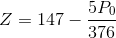

Weather Prediction is a very simple stochastic algorithm for predicting weather from datasets, using probability distributions and single exponential smoothing.

[](https://app.codacy.com/manual/lepynicolas/WeatherPrediction?utm_source=github.com&utm_medium=referral&utm_content=nicolasLepy/WeatherPrediction&utm_campaign=Badge_Grade_Dashboard)

## Main tasks

*   Predicting temperature
*   Predicting humidity
*   Predicting weather
*   Predicting cloudiness
*   Predicting the wind
*   Add indicators (Humidex, Windchill)

## Algorithm

Algorithm used is quite simple, use simple mathematicals concepts and take into consideration only a few parameters, so the efficiency is relative and only allows a globally consistent prediction but without extreme scenarios.

### Predicting the day's temperature of a city 

A normal distribution is used to determine gross variation in temperature from one day to the next.


Then, single exponential smoothing is used to smooth temperature to seasonal normal, to avoid inconsistent temperature.

The alpha parameter determines the importance of flattening.

*   1: the temperature is entirely influenced by the seasonal normal.
*   0 : the seasonal normal is ignored.


Finally, to remain consistent with other cities, temperature of a city (called after the station) is influenced by temperature of the other cities the day before. A city close to another must have a similar weather.


Beta parameter determine how this influence is big.

*   1 : total influence
*   0 : no influence

Influence temperature of other cities is the sum of temperature of other cities multipled by proximity of the city to the station. 


City influence is the ratio of its distance to the station to the sum of all distances


### Predicting the day's athmospheric pressure of a city

A similar process is used to predict athmospheric pressure of a city.

For each city, three local extrema (morning, afternoon and evening) of athmospheric pressure are forecasted.

Gross variation is determined by a normal distribution.


Once again, single exponential smoothing is used to smooth pressure to expected pressures, to avoid disproportionate values.


### Predicting weather (cloudiness, rain)

Thanks to pressure, altitude and temperature of the city we can make an approximation of the coming weather.

First of all, we need to get the sea level pressure, called .


T is temperature of the city
P is the athmospheric pressure
h is the altitude of the city

Once  is obtained, we can obtain a "weather indicator" called Z, which takes as value : 

*   If pressure is falling : 
*   If pressure remains steady : 
*   If pressure is rising : 

Then,

*   if current season is winter, Z = Z - 1
*   if current season is summer, Z = Z + 1

(Normaly, wind direction affects weather, but as wind is not yet implemented, this part is currently ignored)

Finally, we obtain a number between 1 and 32, corresponding to the coming weather

### Predicting cloudiness

To estimate cloudiness value around the map, a matrix is built representing areas of the map with its cloudiness value.

From waters source, water is evaporated and form clouds. Then, clouds are dispersed around the map, but thanks to athmospheric pressures, clouds can more easily follow one direction or another.

### Predicting wind

Currently, an edge detection is computed on cloudiness matrix to estimate wind on the map, using the following kernel :


### Hourly forecasts

Polynomial interpolation is used to determine temperature, pressure and humidity at a specific time thanks to min and max values.

### Obtain the temperature in any coordinates on the map

It is possible to estimate temperature and other indicators at every point on the map thanks to inverse distance weighting.


Where :


*   u(x) is the estimated temperature of point x.
*   d(x,xk) is the distance between x and xk.
*   uk is the temperature of the station k.
*   p is a power parameter. A greater value of p gives more importance to closer values of x.

The temperature of a point is influenced by each station on the map, but the closer the station is, the greater the impact on estimated temperature, and vice versa. 

## Data

Currently, data used is only seasonal normal temperature for each day, for each city, and athmospheric pressure.

City is described by its coordinates, its altitude and its seasons.

Seasons are described by their date, and their average values of athomspheric pressure.

A report is described by its minimal temperature (TMin), maximal temperature (TMax), date and athmospheric pressure.

### Data Format

```
SeasonDef,Season_Name,Begin,End,Min_Pressure,Max_Pressure,Winter_Season
Region,RegionName,MapSizeX,MapSizeY,MapPath
City,City name,X coordinate, Y coordinate,Altitude
AddSeason,Season_Name
Date,TMin,TMax
...
EndCity
EndRegion
```

Example

```
SeasonDef,StandardTatooine_Winter,01/01,01/06,1000,1020,True
SeasonDef,StandardTatooine_Summer,01/06,31/21,1015,1035,False
Region,Tatooine,1900,1250,tatooine.png
City,Bestine,1174,611
AddSeason,StandardTatooine_Winter
AddSeason,StandardTatooine_Summer
01/06/0280,18,36
02/06/0280,18,37
03/06/0280,18,37
EndCity
City,Carnthout,1280,711
AddSeason,StandardTatooine_Winter
AddSeason,StandardTatooine_Summer
01/06/0280,17,34
02/06/0280,17,34
03/06/0280,17,35
EndCity
EndRegion
```

## Example

### Tatooine dataset


Hourly temperature


Weather forecasts


Overview of the map


Animation of the temperature evolution over a day


Animation of the athmospheric pressure evolution over a day


Animation of the cloudiness evolution over a day (assuming there is a water source in the southeast corner of the map)


Animation of the wind evolution over a day


## Authors
Nicolas Lépy

## Tools used
Visual Studio
C#
WPF

## Credits

*   [Selvaraj, Poornima & Marudappa, Pushpalatha & Sujit Shankar, J. (2019). Analysis of Weather Data Using Forecasting Algorithms: ICCI-2017. 10.1007/978-981-13-1132-1_1](https://www.researchgate.net/publication/326748913_Analysis_of_Weather_Data_Using_Forecasting_Algorithms_ICCI-2017)
*   [Mathematical function describing the Zambretti forecaster](https://web.archive.org/web/20110610213848/http://www.meteormetrics.com/zambretti.htm)
*   [Inverse distance weighting](https://fr.wikipedia.org/wiki/Pond%C3%A9ration_inverse_%C3%A0_la_distance)
*   [Tatooine Map (for demo)](https://www.reddit.com/r/sw5e/comments/aiv99p/cleaned_up_a_map_of_tatooine_i_found_on/)
*   [VClouds Weather Icons© by VClouds](http://vclouds.deviantart.com/)
*   [Live Charts for WPF](https://lvcharts.net/)
*   MathNet.Numerics

## License

This project is licensed under the MIT License - see the [LICENSE.md](LICENSE.md) file for details
